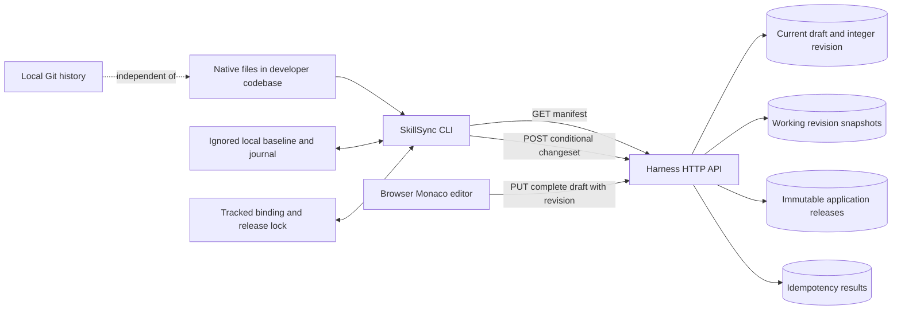
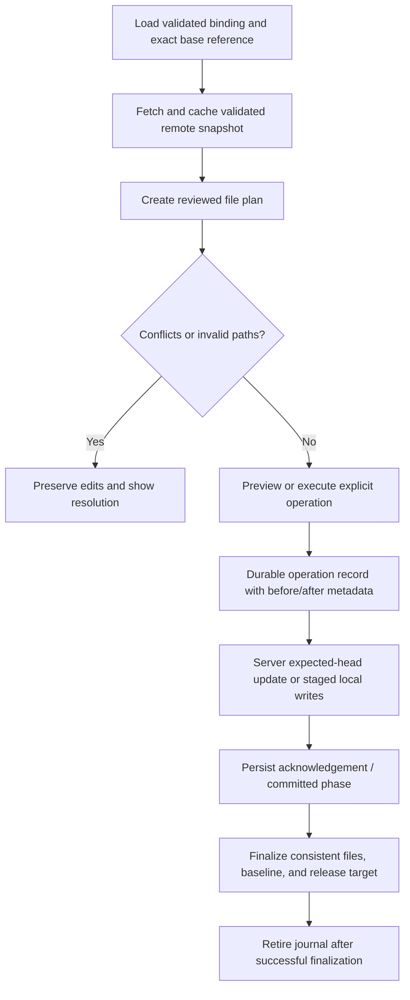

# Harness push/pull and version engine audit

> This is the original pre-fix audit. Confirmed defects and reproduced gaps have been addressed in CLI 0.1.2; see [implemented fixes, validation and remaining decisions](sync-version-engine-fixes.md). Source line references below describe the audited 0.1.1 snapshot.

Date: 2026-10-03. Scope: this local checkout, including the `@skillsync/cli` 0.1.1 application, shared contracts, Harness API, SQL migrations, and browser revision history. The registry tarball was not independently downloaded or compared.

## Assessment

The current system is an HTTP synchronization engine with a single remote draft and linear PostgreSQL snapshot history. It uses Git-like command names, but it does not create Git objects, commits, branches, remotes, or merge ancestry. Local Git and Harness history are separate systems.

The existing approach can support publishing native agent configuration reliably without immediately becoming a Git hosting service. Correctness fixes should come first. Fresh-clone setup, interrupted synchronization, dry-run behavior, and consistent publication validation need work before expanding collaboration. Branches, contribution reviews, and Git transport require an explicit architecture decision.

**Findings:** eight confirmed defects, three experimentally demonstrated design gaps, and further architectural improvements described below. Confirmed does not mean a production incident occurred. Reproductions used temporary local files, mocked HTTP, and synthetic values; no user Harness was pushed, restored, or published during this audit.

## Research basis

| Reference                                                                                                                                 | Relevant behavior                                                                          | Consequence for SkillSync                                                                                                              |
| ----------------------------------------------------------------------------------------------------------------------------------------- | ------------------------------------------------------------------------------------------ | -------------------------------------------------------------------------------------------------------------------------------------- |
| [Git push](https://git-scm.com/docs/git-push)                                                                                             | Transfers objects and updates refs; expected-ref checks protect against concurrent changes | The current revision compare-and-swap is useful concurrency protection, but is not Git ancestry or fast-forward validation             |
| [Git pull](https://git-scm.com/docs/git-pull)                                                                                             | Fetches remote history and then integrates it                                              | Current pull downloads a snapshot and reconciles files; there is no separate fetch or local commit integration                         |
| [Git object model](https://git-scm.com/book/en/v2/Git-Internals-Git-Objects)                                                              | Trees describe snapshots; commits refer to trees and parents                               | A tree checksum alone is not a commit or a history graph                                                                               |
| [Git ignore rules](https://git-scm.com/docs/gitignore)                                                                                    | Ignore patterns concern untracked files and can travel with a repository                   | Ignored synchronization state must be reconstructible after clone; an ignore entry alone does not remove already-tracked state         |
| [Git attributes](https://git-scm.com/docs/gitattributes)                                                                                  | Controls text normalization and working-tree line endings                                  | Exact byte comparisons need a declared line-ending policy alongside Git checkout behavior                                              |
| [Semantic Versioning](https://semver.org/)                                                                                                | Disallows leading zeroes and requires released version contents to remain stable           | Current leading-zero acceptance needs correction; stable release snapshots should remain stable                                        |
| [Node.js 24 filesystem API](https://nodejs.org/docs/latest-v24.x/api/fs.html#fspromiseswritefilefile-data-options), fetched with Context7 | `writeFile` can involve multiple writes; flushing is optional                              | Temporary-file replacement and an explicit durability/recovery policy are needed; a journal by itself is not crash-atomic installation |

These references establish comparison criteria. They do not imply every Git feature belongs in the first SkillSync release. The recommendations below are engineering judgments based on the observed code and product requirements.

## Current architecture



### Identity and persistence

- Harness identity is a UUID. Its current draft has an integer revision.
- `harness_revisions` stores a UUID, Harness ID, revision number, full JSON file snapshot, author, source, message, and timestamp. There are no parent IDs, branch refs, or persisted tree hashes.
- `harness_releases` stores its own UUID, unique version string per Harness, draft revision number, full snapshot, notes, and timestamp. Releases are stable through the application API; the shown migrations do not add database-level append-only protection.
- `harness_changesets` stores a request UUID, payload hash, and complete response for retry deduplication.
- `.skillshare/config.json` binds a working directory to one server, Harness, and profile selection.
- `.skillshare/lock.json` records the target release and checksums. The content baseline and recovery state are in ignored `.skillshare/local/`.
- CLI credentials live outside the codebase. Browser and CLI credentials have separate refresh paths; API ownership and CLI scopes still control operations.

Evidence: `apps/api/src/db/migrations/004-harness-repositories.sql`, `007-cli-sync.sql`, `apps/cli/src/config.ts`, and `apps/cli/src/sync.ts`.

### Push

1. Load binding and local baseline; fetch the current remote draft.
2. Scan selected native paths and compare baseline/local/remote per file.
3. Block overlapping edits and unapproved deletions.
4. Persist a pending request UUID before uploading.
5. Server locks the Harness row, checks an earlier request result, and checks the expected revision.
6. Server applies selected changes, preserves other files, appends a snapshot when the tree changes, and records the idempotency result in one transaction.
7. CLI updates its local baseline and removes the pending request.

### Pull

1. Resolve an explicit draft/version, the installed release ID, or latest release.
2. Fetch and validate the snapshot checksum; scan local files.
3. Compare three states per path. Preserve local-only edits; block edit/edit and edit/delete conflicts.
4. Require review acknowledgement for writes and explicit permission for deletion.
5. Write a recovery journal, recheck local files, and apply changes sequentially.
6. Save the baseline, update the release lock, and remove the journal.

The six-step pull sequence spans multiple files and metadata writes. It is not a filesystem transaction.

## Safeguards that should be retained

- Parameterized SQL, ownership checks, row locks, and revision checks on writes.
- Transactional snapshot and idempotency recording. A stale push cannot simply overwrite a newer draft.
- A reused request ID with a different payload is rejected.
- A no-op changeset does not increment the draft revision.
- Content checksums and exact release IDs; release pinning is distinct from editing a draft.
- Unselected native files are preserved by partial changesets.
- Explicit deletion approval and whole-file conflict blocking.
- Symlink/junction checks, path restrictions, UTF-8 validation, file/total size limits, and executable-bit handling.
- Recovery refuses to overwrite files edited after interruption.
- Browser restoration creates another working revision instead of mutating a release.

These are substantial existing protections. The findings concern failure boundaries and missing capabilities around them.

## Confirmed defects

Priority meanings: **P1** fix before wider production/team use; **P2** fix in the next correctness release. No P0 incident or external exploit was demonstrated.

| ID  | Priority | Defect                                                                      | Evidence                                                                     | Verification                                                                                      |
| --- | -------- | --------------------------------------------------------------------------- | ---------------------------------------------------------------------------- | ------------------------------------------------------------------------------------------------- |
| B1  | P1       | Fresh Git clones cannot reconstruct ignored baseline                        | `config.ts:95`, `sync.ts:97`, `files.ts:118` in `apps/cli/src`               | Reproduced missing-state `ENOENT` and rejection by `add`                                          |
| B2  | P2       | Replaying a committed push after another local edit leaves a stale baseline | `apps/cli/src/sync.ts:81`, `:241`, `:256`                                    | Reproduced false conflict after accepted replay                                                   |
| B3  | P1       | Interrupted pull recovery does not restore synchronization metadata         | `apps/cli/src/sync.ts:224`, `apps/cli/src/files.ts:203`                      | Reproduced files restored to A while baseline remained B                                          |
| B4  | P2       | Snapshot validation accepts file/directory ancestor collisions              | `packages/contracts/src/index.ts:43`                                         | Schema accepted `.claude/agents` and `.claude/agents/reviewer.md` together                        |
| B5  | P2       | Version validation accepts leading zeroes                                   | `packages/contracts/src/index.ts:74`                                         | Validator accepted `01.02.03`                                                                     |
| B6  | P1       | Recovery itself cannot safely resume after interruption                     | `apps/cli/src/files.ts:222`, `:236`                                          | Already-restored file rejected on recovery retry                                                  |
| B7  | P1       | `--dry-run` still publishes or performs recovery writes                     | `apps/cli/src/bin.ts:91`, `:143`, `:158`; `sync.ts:265`                      | Actual local CLI build sent a publication POST and restored files against an isolated mock server |
| B8  | P1       | CLI shareability policy is absent from browser/API publication              | `apps/api/src/modules/harnesses/harness.sync.ts:95`, `harness.service.ts:99` | Differential validation reproduced; publication control flow inspected                            |

### B1 — a normal clone has no supported bootstrap

**Reproduction:** copy the tracked binding/native files without `.skillshare/local/state.json`, authenticate the configured server, then run `status` or `pull`. Both require `state()` before doing useful work and fail with `ENOENT`. `add` refuses because the binding already exists.

**Fix:** introduce an explicit bootstrap/repair operation, or a guided missing-state path. Reconstruct a baseline from the exact pinned release or a persisted base revision ID. Preserve local files, preview differences, and require acknowledgement before changing a binding. An unpinned owner checkout needs a deliberate baseline choice; treating today's draft as the historical base can misclassify changes.

**Acceptance:** a fresh clone with a valid tracked binding and lock can authenticate, inspect status, and pull without deleting configuration or inventing a baseline.

### B2 — retry acknowledgement and the current working tree are confused

**Reproduction:** baseline A → submit B → server accepts but response is lost → edit locally to C → retry the saved request. Replay correctly returns B, but `nextBaseline()` compares B with current C and retains A. The next push sees A/C/B and reports an overlapping conflict with the user's own previously committed edit.

**Fix:** persist submission context with the pending request. After acknowledgement, advance the baseline for the request's accepted paths to their accepted values, even if the working files changed again. Preserve the baseline for unrelated remote-only edits. Resolve whether the original request was accepted before calculating new changes.

**Acceptance:** retry followed by a push publishes C as a new local edit, while unrelated remote changes remain pending.

### B3 — a pull journal covers files but not its metadata commit

**Reproduction:** apply A→B, save baseline B as the pull currently does, interrupt before journal removal, and run recovery. Recovery writes A back but leaves baseline B/revision 2. The release lock and Windows mode metadata are also outside the rollback contract.

**Fix:** journal the prior and proposed baseline, release lock, mode map, binding changes during installation, and operation phase. Define a clear committed state. Recovery should roll back an uncommitted operation completely, or finish a committed operation. It must not mix old native files with new synchronization metadata.

**Acceptance:** fault injection after every native and metadata write produces either a consistent old state or a consistent new state.

### B4 — impossible filesystem trees pass validation

The current uniqueness check rejects duplicate/case-equivalent paths but does not reject a file that is also another file's parent. Installation can therefore fail partway through creating a valid-looking snapshot.

**Fix:** validate normalized path ancestry in the shared schema before draft import, changesets, publication, or pull writes. Enforce a single portable path policy across web and CLI; their unsafe-name rules currently differ.

**Acceptance:** parent-file/descendant-file pairs are rejected regardless of order or casing, before any native writes.

### B5 — the release contract is not strict X.Y.Z/SemVer validation

The numeric regex accepts leading zeroes. It also excludes prereleases and build metadata; that restriction can be intentional, but needs explicit product documentation. The [SemVer specification](https://semver.org/) prohibits leading zeroes.

**Fix:** share a strict validator between CLI and API. Either deliberately support strict stable X.Y.Z only, or support complete SemVer and define prerelease channels. Do not imply full SemVer support while accepting malformed stable versions.

**Acceptance:** `01.2.3` is rejected; stable and prerelease examples follow the documented contract.

### B6 — interruption during rollback is another unrecoverable state

**Reproduction:** after a pull writes B, recovery restores A but stops before removing the journal. A second recovery checks completed paths against B and rejects A as an external edit. There is no rollback-progress journal.

**Fix:** persist rollback phases/progress. Treat a path matching its original value as already restored; treat a path matching its applied value as still eligible for rollback; preserve and report anything else. Apply this rule to metadata too.

**Acceptance:** repeated interruption and retry can finish rollback without overwriting genuine subsequent edits.

### B7 — dry-run is a lock bypass, not a universal mutation guard

`mutate()` calls the supplied function directly when `--dry-run` is present. `publish()` and `recover()` do not implement previews, so those operations still write. The isolated CLI probe observed one release POST from `publish 1.0.0 --notes ... --yes --dry-run`, and actual native rollback from `recover --dry-run`.

**Fix:** validate options per command. Either implement a read-only preview for these commands or reject their unsupported flag before any operation. Keep mutation locking independent from preview policy. Also audit accepted flags such as mutually exclusive `--draft`/`--version`, and unsupported flags ignored by other commands.

**Acceptance:** every accepted dry-run command produces no remote content mutation and no local native/binding/state mutation. Document credential refresh separately from content preview.

### B8 — publication has inconsistent credential checks

A synthetically populated `.mcp.json` passes the snapshot schema and native configuration inspection used by publication, while CLI `assertShareable()` rejects it. The API changeset route invokes that guard; browser draft creation/save and the publishing service do not.

This demonstrates a validation gap, not that a real credential was published. Regex checks are also not comprehensive secret detection.

**Fix:** apply a common publication policy to the entire proposed release regardless of entry path. Permit private editing where needed, but block recognized literal credentials from reusable/public releases with path-only errors and environment-reference guidance. Decide explicitly whether private releases have the same shareability contract. Add a reviewable, stronger secret-detection policy without printing matches or pretending all secrets can be verified automatically.

**Acceptance:** the same snapshot receives consistent decisions through CLI push/publish and browser/API publish. Include settings, MCP, hooks, support files, and unselected profiles.

## Reproduced design gaps

| ID  | Gap                                                     | Observed behavior                                                                                  | Recommended change                                                                                                                                                                                                                            |
| --- | ------------------------------------------------------- | -------------------------------------------------------------------------------------------------- | --------------------------------------------------------------------------------------------------------------------------------------------------------------------------------------------------------------------------------------------- |
| G1  | Target release and installed contents are conflated     | Pull preserves a local-only variant but writes the remote release/checksums into the lock          | Store `targetReleaseId`, selected profiles, base reference, effective local tree checksum, and a divergence indicator separately. A release pin must not imply byte-identical local contents                                                  |
| G2  | Cross-platform text changes become whole-file conflicts | A local LF→CRLF checkout change plus a remote content edit causes conflict                         | Declare per-file text policy; optionally use a reviewed textual three-way merge. Keep exact source bytes where required; do not silently normalize all native files. Coordinate with [Git attributes](https://git-scm.com/docs/gitattributes) |
| G3  | Schema limits and transport limits disagree             | Valid 5,000,000-byte text serialized to 10,000,914 bytes, exceeding Express's 6 MB JSON body limit | Validate actual encoded request size, align limits, and eventually transfer blobs rather than full escaped snapshots. Return a precise size error                                                                                             |

## Architectural and UX improvements

| Area                                      | Current limitation                                                                                                    | Improvement / constraint                                                                                                                                                                                     |
| ----------------------------------------- | --------------------------------------------------------------------------------------------------------------------- | ------------------------------------------------------------------------------------------------------------------------------------------------------------------------------------------------------------ |
| History and ancestry                      | Single integer chain; no parents, branches, contribution base, or local commits                                       | If collaboration is required, add explicit refs and parent relationships or adopt real Git as the content authority. A UUID alone does not create ancestry                                                   |
| History browsing                          | Working history query returns only 100 newest revisions                                                               | Stable cursor pagination; older records remain in the database, but are not discoverable through the current list UI                                                                                         |
| Latest release                            | Release selection is publication-time order, not highest stable SemVer                                                | Define `latest`, stable, prerelease, and backport behavior explicitly. Newest publication can be intentional; do not silently present it as highest version                                                  |
| Snapshot storage                          | Draft, each revision, changeset response, and releases repeat complete file trees                                     | Content-addressed blobs/trees, stored checksums, compact retry receipts, quotas, measured retention and backup policy. Do not expire retry records without a documented recovery contract                    |
| Database invariants                       | Release revision is an integer, not a foreign key to an immutable revision; no append-only database rule              | Add stable revision references and integrity verification. Backfill older published snapshots carefully: the historical migration retained existing draft heads, not every earlier draft                     |
| Protocol validation                       | Manifest and pending-request code use `any`/casts for several identity/reference fields                               | Shared versioned request, manifest, lock, journal, receipt, and state schemas; validate before native writes or metadata commit                                                                              |
| Hashing                                   | SHA-256 tree serialization is duplicated in CLI/API and omits a format identifier                                     | One canonical, versioned hash definition with byte-level test vectors for Unicode, path ordering, executable flags, and line endings. A checksum detects mismatched data; it is not publisher authentication |
| Offline use                               | `status`/`diff` fetch remote state on every call                                                                      | Separate local status and last-fetched remote status, with freshness labels; introduce an explicit fetch/cache step if useful                                                                                |
| Merge and rename UX                       | Any differing whole-file concurrent edits conflict; rename appears as delete/add                                      | Reviewed text merge, conflict markers/preview, rename suggestions, structured JSON conflict display. Keep explicit deletion permission and avoid speculative automatic semantic merges                       |
| Publication review                        | CLI validates local selected profiles but publishes all remote profiles                                               | Preview the complete release changes and requirements, including unselected profiles, with the reviewed revision/hash carried to the final request                                                           |
| Team contributions                        | Viewer membership exists, but draft writes/history are owner-only                                                     | Define editor/publisher capabilities and proposal reviews explicitly. Platform admin roles must remain separate from project content permissions                                                             |
| Credential scope                          | CLI scopes select actions across owned Harnesses                                                                      | Optional per-Harness grants, resource-scoped capability display, and clearer revocation. `canWrite` currently describes ownership, not the intersection with the token's scopes                              |
| Repository bootstrap and branch switching | Ignored state is not tied to a local Git branch or reconstructible ref                                                | A persistent base reference, safe branch-change detection, explicit rebind/repair, and tests using separate Git worktrees                                                                                    |
| Performance                               | Pull rescans all selected files for each change; hash/baseline operations repeatedly search arrays                    | Validate snapshot once, index by path, then recheck only touched files before writes. Benchmark limits before choosing blobs or worker changes                                                               |
| Portability                               | Local symlinks are intentionally refused; referenced resources outside selected roots are not automatically collected | Document that policy and add explicit resource selection/review if needed. Do not follow arbitrary references outside the codebase                                                                           |

## Risks requiring additional fault and platform testing

These are code-derived risks, not demonstrated production failures:

- Native writes truncate the target directly rather than writing a sibling temporary file and replacing it. Metadata replacement does not request an explicit flush. Validate process interruption and power-loss behavior separately; the [Node.js filesystem documentation](https://nodejs.org/docs/latest-v24.x/api/fs.html#fspromiseswritefilefile-data-options) does not promise multi-file transactions.
- A separate editor can change a file between its last comparison and overwrite; the CLI operation lock only coordinates cooperating CLI commands. Test external-writer races and preserve divergent backups instead of assuming an exclusive working tree.
- Windows executable-mode metadata changes before the native file write. Failure between those steps can make recovery comparison ambiguous.
- Path checking and subsequent writes are separate calls. Symlink replacement races need targeted platform testing; existing checks are valuable but do not prove immunity to every concurrent path mutation.
- Live authentication response loss during refresh can require another login under rotating credentials. Audit that boundary separately; do not weaken replay detection merely to make retries succeed.
- Linux/macOS keyrings, executable permissions, network filesystems, Windows junctions, concurrent Git checkouts, and actual PostgreSQL contention need targeted runs. The embedded integration database is not a substitute for all of those environments.

## Recommended architecture direction

### Decision options

| Option                                    | Appropriate use                                                                                         | Main tradeoff                                                                                                                 |
| ----------------------------------------- | ------------------------------------------------------------------------------------------------------- | ----------------------------------------------------------------------------------------------------------------------------- |
| Retain HTTP synchronization and repair it | Native-file distribution, private workspace edits, immutable releases                                   | Smallest migration; must accurately describe its own revision and merge semantics                                             |
| Git import/export bridge                  | Developers want to move selected Harness snapshots to/from an existing repository                       | Map a selected Git commit/ref to a Harness snapshot with recorded provenance; keep only one writable content authority        |
| Git as canonical content/history          | Actual Git clones, branches, push/pull interoperability, contribution reviews are defining requirements | Requires Git transport auth, repository isolation, protected refs, and reliable metadata indexing; largest operational change |

**Recommendation:** first repair the current HTTP engine. Then add a reviewed Git bridge if users need integration with existing development repositories. Choose Git as the canonical engine only if native Git interoperability and branching are requirements. Avoid two independently writable histories with best-effort bidirectional mirroring.

### Safer HTTP engine model



The desired state machine is `prepared → applying → committed → finalized`, with resumable `rolling-back` and explicit conflict states. It should have an operation UUID, checked base/target identity, submitted-path values, and before/after synchronization metadata. Atomic replacement is per file; the journal provides resumable multi-file consistency rather than claiming that the filesystem has a database transaction.

### If real Git is adopted later

Use commits and refs as the authoritative content/history model; releases point to exact commit identities. Keep users, permissions, reviews, and activity in PostgreSQL. Web edits must create commits through the same authorization boundary as CLI edits. Ref updates need expected-head checks and protected-branch policy. Indexing/activity can consume a durable outbox, with explicit pending states when metadata lags. Existing revision UUIDs and release URLs need migration mappings so consumers retain stable exact-version links.

A migration must preserve native paths, source text, ownership, authorship, and old release snapshots. Do not claim that old linear integer revisions contain merge ancestry they never recorded. Use an existing Git implementation rather than implementing Git wire/storage protocols from scratch.

## Delivery sequence and acceptance checks

| Step | Change                                                           | Exit criterion                                                                                                                 |
| ---- | ---------------------------------------------------------------- | ------------------------------------------------------------------------------------------------------------------------------ |
| 1    | Dry-run option enforcement and consistent publication validation | Unsupported previews fail safely; accepted previews do not mutate content; all publication entry paths enforce the same policy |
| 2    | Operation journal and acknowledgement redesign                   | Crash after every file/metadata step and recovery step is resumable; pending push replay preserves subsequent local edits      |
| 3    | Clone bootstrap and base/reference identity                      | Fresh clones and branch changes work without deleting tracked configuration; divergence is visible                             |
| 4    | Shared path, version, manifest, lock, and journal validation     | Impossible trees rejected; version contract explicit; encoded payload limits coherent                                          |
| 5    | History pagination, release channel policy, full-release review  | Older revisions discoverable; exact releases stable; unselected profiles reviewed                                              |
| 6    | Measured storage/transfer improvements                           | Benchmarked payload, latency, disk growth, and retention targets; integrity checks pass after migration                        |
| 7    | Team proposals / Git integration decision                        | One chosen content authority; ownership, branch policy, review, and migration contracts tested                                 |

Suggested regression matrix: fresh clone; local-only/remote-only/identical edits; edit/edit and edit/delete; rename; parent-path collision; mode-only change; CRLF/LF; no-op push; lost push response then new local edit; interruption at every journal phase; interrupted recovery; expired/revoked/read-only CLI session; stale revision; duplicate and changed idempotency payload; pinned release with local divergence; earlier stable/prerelease publication; unsupported flag combinations; large escaped JSON.

## Validation performed and review artifacts

- Existing CLI and API integration suites: **41 passed, one existing skipped**, across three test files. This audit did not fix the engine defects, so these passes also show coverage gaps.
- Ten isolated synchronization/schema scenarios reproduced B1–B6, B8, and G1–G3. B8 combines executed gate comparisons with publishing-service inspection; it was not tested by publishing a real credential.
- A separate subprocess test exercised the local built CLI and confirmed both B7 dry-run mutations against a disposable mock HTTP server and temporary files.
- No live Harness content, role, release, or credentials were used by the audit reproductions. Fixtures and synthetic credentials are under `.local/audits/`.
- No power-loss, distributed load, production authorization review, npm tarball comparison, or Linux/macOS run was performed. Those remain validation work rather than verified claims.

Reproduction scripts:

- [Synchronization and validation scenarios](../scripts/audits/sync-audit.mts)
- [Built CLI dry-run scenarios](../scripts/audits/cli-flags-audit.mts)

Run from the repository root with the installed development toolchain:

```powershell
node node_modules/tsx/dist/cli.mjs scripts/audits/sync-audit.mts
node node_modules/tsx/dist/cli.mjs scripts/audits/cli-flags-audit.mts
node node_modules/vitest/vitest.mjs run apps/cli/src apps/api/src/integration.test.ts --configLoader native
```

The second script uses `apps/cli/dist/bin.js`; rebuild the CLI before comparing future fixes. The scripts now assert corrected behavior after the implementation; the defect reproductions above describe the original audit. They write results to `.local/audits/sync-audit-results.json` and `cli-flags-results.json` and keep fixtures for inspection. The reports contain synthetic values only.
